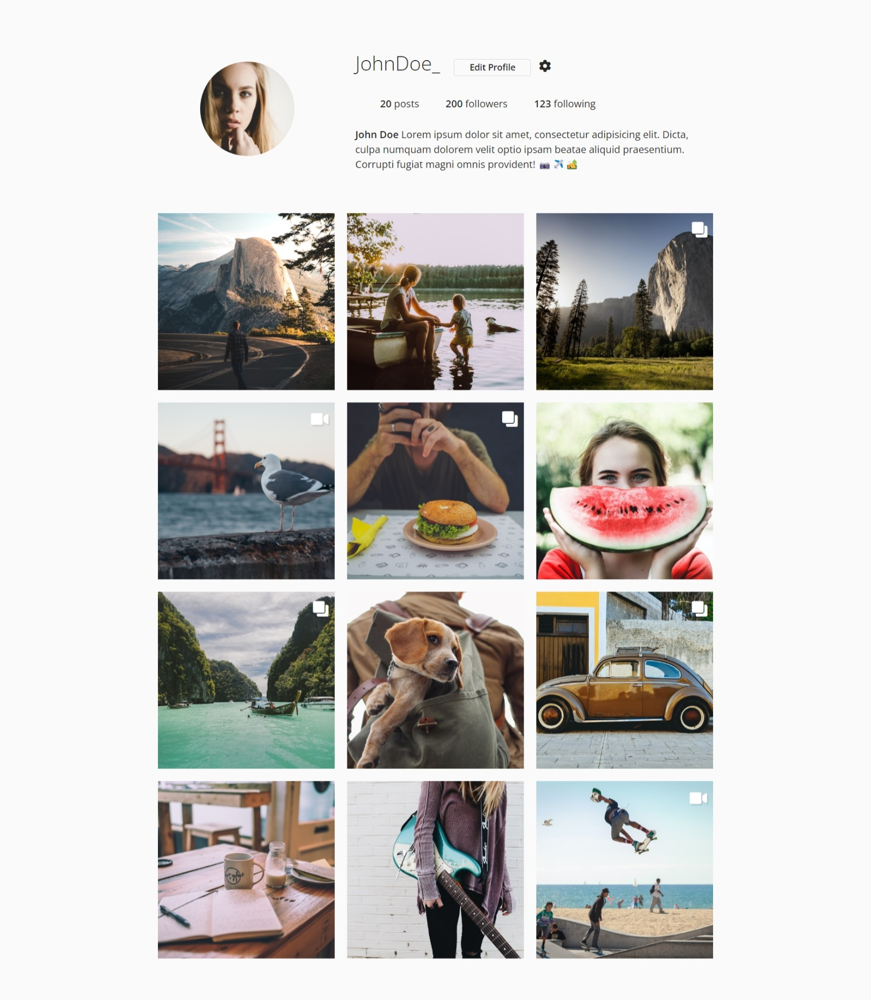
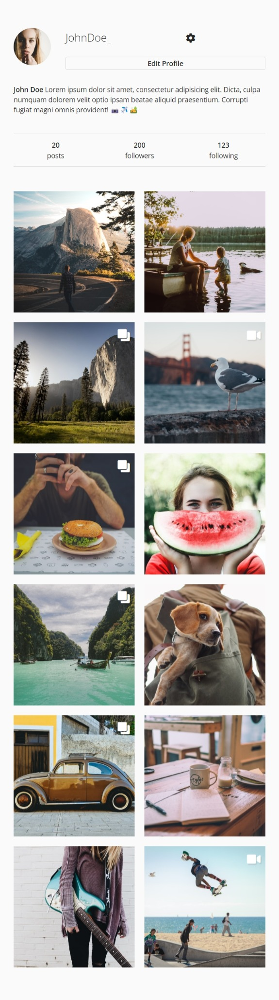
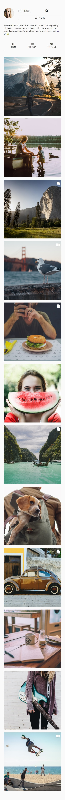
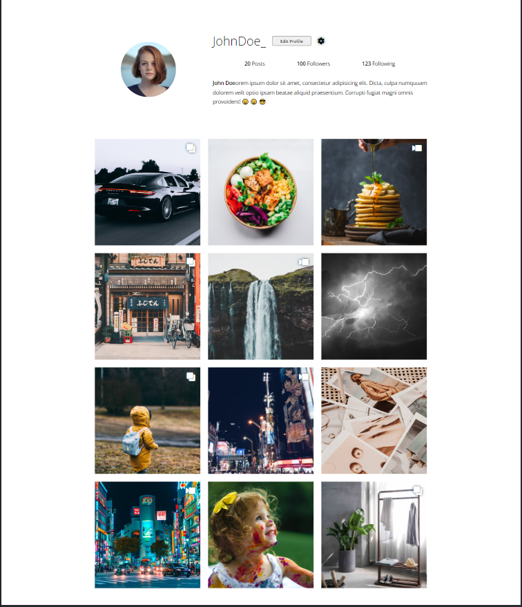
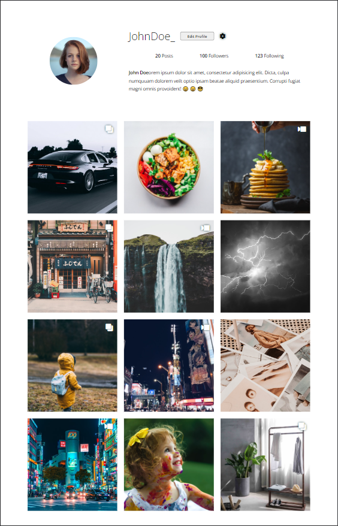
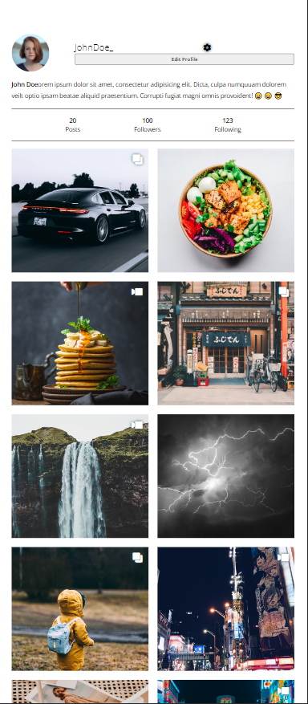
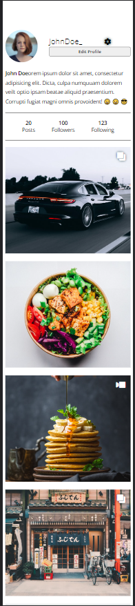
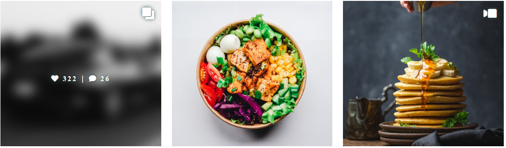

# Instagram Layout Task

## Libraries to Import

```
<link rel="stylesheet" href="https://fonts.googleapis.com/css?family=Open+Sans:300,400,600">
```
```
<link rel="stylesheet" href="https://use.fontawesome.com/releases/v5.2.0/css/all.css">
```

## Typography

Font : "Open Sans", Arial, sans-serif

## Icons to use 

1. fa-comment (comment)
2. fa-cog (settings)
3. fa-heart (like)
4. fa-video (video items type)
5. fa-clone (album items type)

<strong>To rotate any icon – use transform CSS property<strong>

## Notes

1. Use Grid for Layouting the gallery, other elements feel free to use whatever you want (grid, flex)

2. For Gallery item type (image, video, album) use positioning

3. display (likes, comments) stats icons only while hovering (or focusing) on the gallery item, by default their display is none

4. for the gallery images use free images provider like (unsplash.com) – and try to search for single topic (personal, nature, tech, architecture, or anything else)

## Responsiveness

1. Gallery Layout is responsive with item min size (220px) – and wraps when resized
2. Use accessible CSS Units
3. On Mobile Screen (max-width 400PX) – (the following is the order of lines)
   
a. profile picture | name | settings

b. profile picture (spanned) | edit profile

c. Bio

d. Stats

e. Galler

## Design
<figcaption> Full Screen Size </figcaption> 

<br>
<figcaption> Mobile Screen Size</figcaption> 

<br>

<figcaption> Mobile Small Screen Size</figcaption> 

<br>

# Student Solution


## Adhere
* Use accessible CSS Units used are:
  *  Root Element (rem).
  *  percentage (%).
* Profile (Top of screen section) elements take the right order and feel of the screenshots provided by the instructor.
* Grid elements in both the Profile and Gallery wrap their elements according to the screen size.

## Problems Encountered
* Aligning items in the profile section as required was difficult.
* While the design is responsive in the profile part, I am still not sure if its the best approach to take.


## Screen Shots
<figcaption> Very Large Screen Size</figcaption> 

<br>
   
<figcaption> Normal Screen Size</figcaption> 

<br>
   
<figcaption> Mobile Screen Size</figcaption> 

<br>
   
<figcaption> Small Mobile Screen Size</figcaption> 

<br>

<figcaption> Active State</figcaption> 



## GitHub Pages
<a href="https://maliklar.github.io/htu-assignment-grid/">
https://maliklar.github.io/htu-assignment-grid/</a>
